<div align="center">

# 🎲 DOZERO — Virtual Tabletop & Worldbuilding Suite

<p align="center">
  <strong>A plataforma local-first definitiva para jogar RPG de mesa online, mestrar com imersão cinematográfica e construir mundos vivos.</strong>
</p>

[](https://nodejs.org)
[](https://react.dev)
[](https://vitejs.dev)
[](https://www.typescriptlang.org)
[](https://pixijs.com)
[](https://supabase.com)
[](https://tailwindcss.com)
[-success.svg)](https://vitest.dev)
[](LICENSE)

<br />

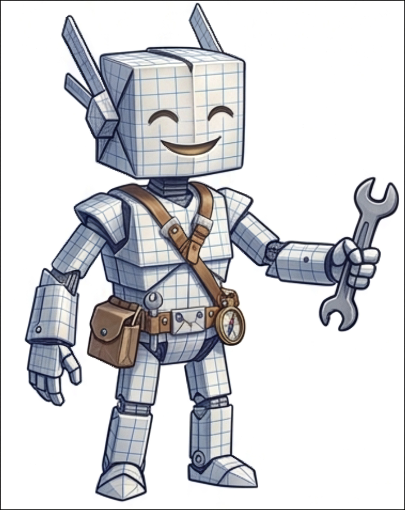

<br />
<br />

[✨ Conheça o Zye](#-conheça-o-zye--nosso-mascote-oficial) •
[🗺️ Modos de Jogo & Galeria](#-modos-de-jogo--galeria-de-telas) •
[⚡ Recursos Principais](#-recursos-principais) •
[🛠️ Stack Tecnológica](#%EF%B8%8F-stack-tecnol%C3%B3gica) •
[🚀 Como Executar](#-como-executar) •
[📖 Documentação](#-documenta%C3%A7%C3%A3o-operacional) •
[🛡️ Segurança](#%EF%B8%8F-seguran%C3%A7a)

---

</div>

## 🌟 O que é o DOZERO?

O **DOZERO** é um **Virtual Tabletop (VTT)** e suíte completa de **Worldbuilding** de última geração, projetado para mestres e jogadores que buscam máxima imersão, performance sem engasgos e controle absoluto sobre suas histórias.

Construído com arquitetura **Local-First** (*offline-first* com sincronização em tempo real via **Yjs** e **Supabase Realtime**), o DOZERO une em uma única aplicação:

- 🗺️ **Mesa Tática WebGL** fluida a 60+ FPS com PixiJS 8, iluminação dinâmica e névoa de guerra poligonal.
- 🎭 **Teatro da Mente Cinematográfico** com diálogos estilo *Visual Novel*, retratos em destaque e climatologia sonora.
- 📖 **Códice Arcanum & Wiki Semântica** com editor Markdown, 12 tipos nativos de entidades e sincronização ao vivo com **Obsidian**.
- 🧠 **Cérebro-Grafo RPG** para visualizar conexões orgânicas, alianças, intrigas e caminhos entre personagens e locais.
- ⚔️ **Forja de Fichas Arcanum & Player Vault** com histórico de versões, snapshots de evolução e exportação portátil.
- ⏳ **Chronica & Calendário Fantástico** com cálculo de ciclos lunares, estações, eras históricas e linha do tempo.
- 🎙️ **Voz WebRTC P2P, Screen Share & Rádio de Biomas** com soundboard procedural integrado.
- 🤖 **Zye & IA Studio RAG** contextualizado com banco vetorial (`pgvector`) e Gemini.

---

## 🤖 Conheça o Zye — Nosso Mascote Oficial!

O **Zye** é o guardião ancestral do DOZERO: um simpático e sábio golem arcano forjado nas linhas do grid tático. Ele é a representação viva da alma do DOZERO — sempre pronto para auxiliar mestres com regras, desenhar novos horizontes, organizar o códice ou liderar a rolagem de dados em combate!

<div align="center">

| 🗺️ Zye Cartógrafo | ✏️ Zye Forjador de Mundos | 📚 Zye Erudito do Códice | ⚡ Zye em Ação | 🤖 Zye Assistente IA |
|:---:|:---:|:---:|:---:|:---:|
|  | 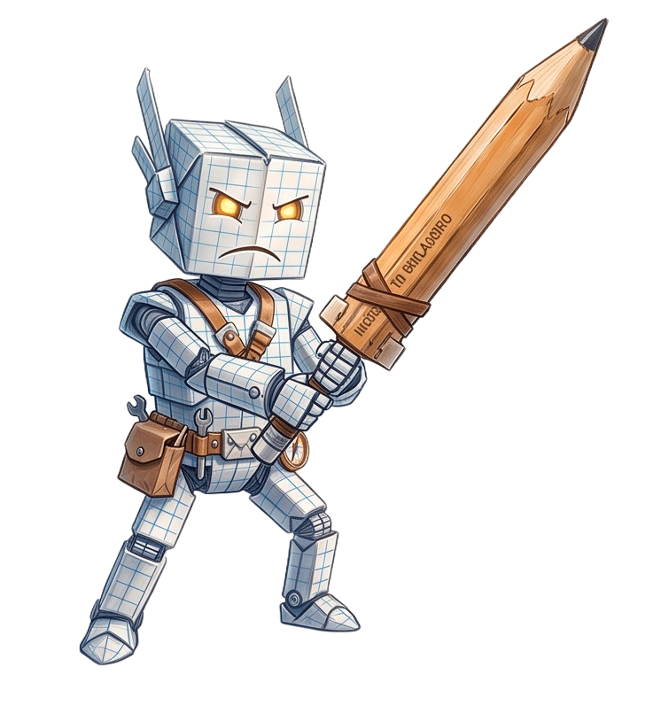 | 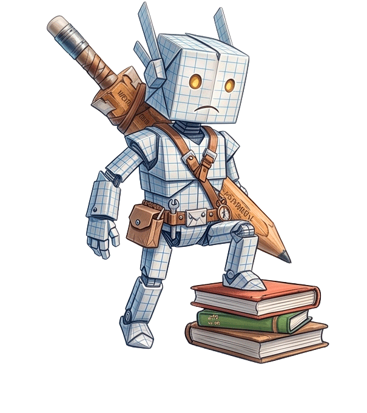 | 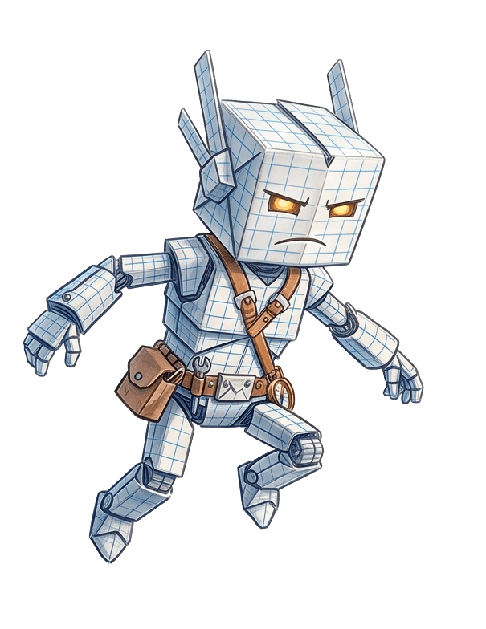 |  |
| *Explorando mapas, névoas de guerra e segredos táticos.* | *Desenhando mapas, criando encontros e forjando aventuras.* | *Catalogando notas, linhagens dinásticas e segredos da lore.* | *Iniciativa ágil, rolagem de dados e macros de combate.* | *Seu parceiro de IA para regras e inspiração em tempo real.* |

</div>

---

## 📸 Modos de Jogo & Galeria de Telas

O DOZERO foi concebido com uma interface modular e adaptável, permitindo alternar instantaneamente entre diferentes frentes de jogo com **0ms de overhead**:

### 🗺️ 1. Mesa Tática WebGL (Tactical Canvas)
Renderizador 2D de alta performance com PixiJS 8, grades quadradas/hexagonais/isométricas, tokens com halo de visão pulsante, paredes táticas com bloqueio de luz, Fog of War dinâmico, réguas de medição de distância e cone, Combat Tracker com rolagem contextual de iniciativa e Soundboard de acesso rápido.

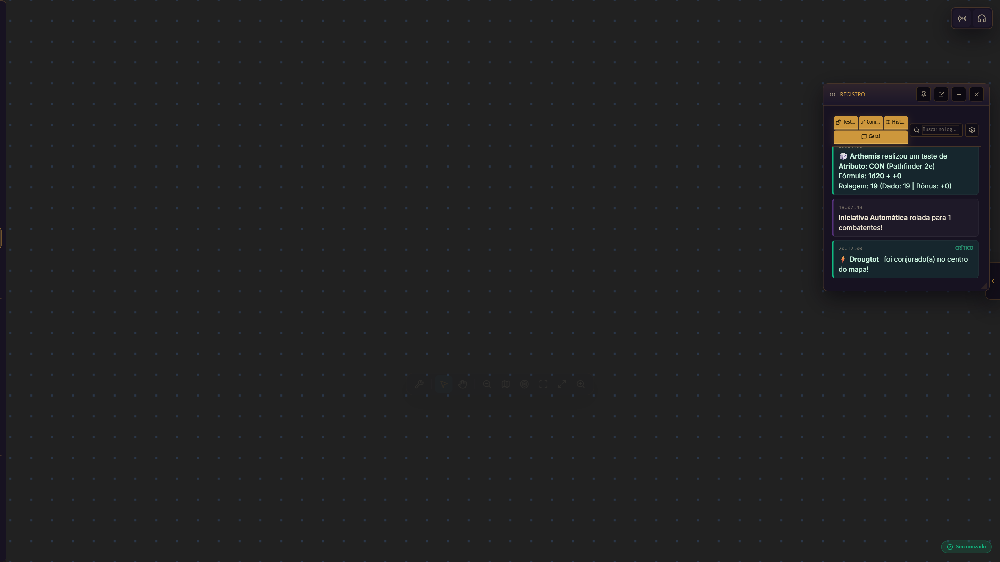

---

### 📖 2. Códice Arcanum & Wiki Semântica (Worldbuilding)
Wiki colaborativa integrada com Markdown completo, suporte a frontmatter, 12 tipos nativos de entidades (Personagens, Lugares, Organizações, Criaturas, Itens, etc.), forja de criaturas em 4 rituais e **Sincronização em Tempo Real com o Obsidian** via Server-Sent Events (`fs.watch`).

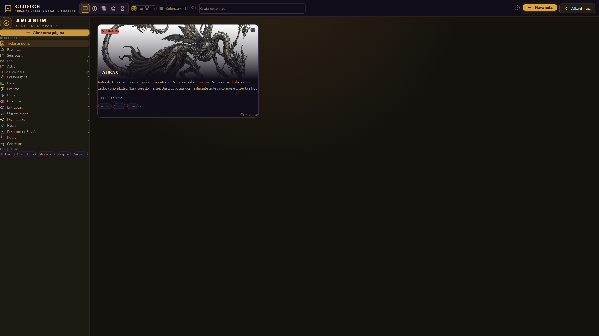

---

### 🎭 3. Teatro da Mente (Theater of the Mind)
Modo focado em narrativa e interpretação dramática. Apresenta retratos de personagens em destaque, legendas cinemáticas com diálogos no formato Visual Novel, motor de clima (chuva, neve, tempestade, névoa), controle de iluminação por cena e trilha sonora procedural sincronizada.

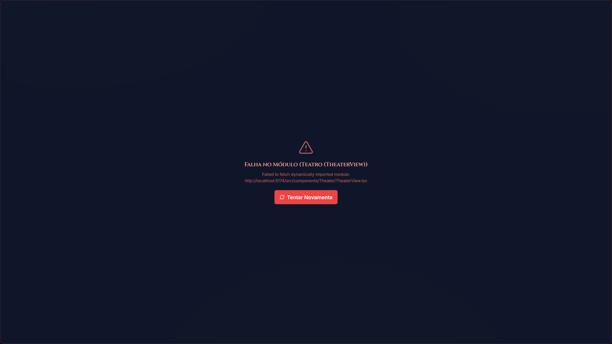

---

### 🧠 4. Cérebro-Grafo RPG (Living Brain)
Grafo visual de conexões e relações semânticas em tela cheia com nós geométricos estilizados (`@xyflow/react`), 11 camadas filtráveis, física elástica orgânica, modo de **Foco Radial**, algoritmo **Pathfinder (BFS)** para menor caminho entre entidades e inspetor instantâneo de lore.

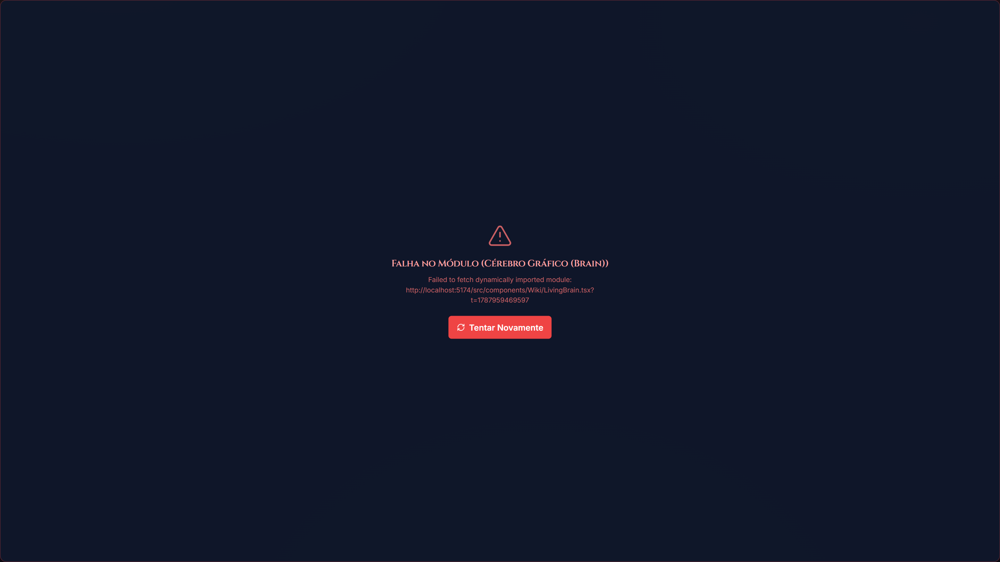

---

### ⚔️ 5. Forja de Fichas Arcanum & Player Vault
Gerenciador e editor visual de personagens Dark Fantasy. Contém 4 abas completas (Visão Geral & Combate com ataques rápidos, Magias & Poderes com consumo dinâmico de PM, Mochila & Inventário com peso/moedas e Biografia com Diário de Sessão), histórico de versões/snapshots com restauração e importação/exportação portátil em `.json`.

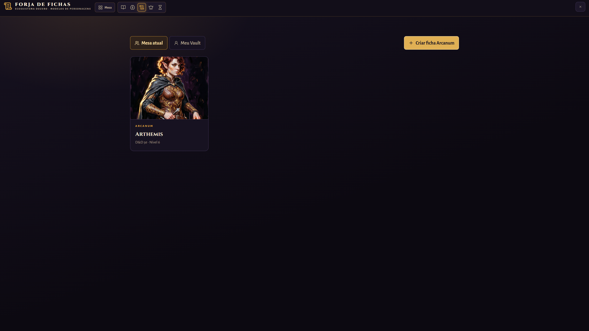

---

### 🏰 6. Lobby de Campanhas & Gestão Multi-Mesa
Hub central para explorar, criar e gerenciar campanhas de múltiplos sistemas de RPG. Permite busca rápida, filtros por sistema, controle de acesso seguro por código e sincronização com a nuvem Supabase.

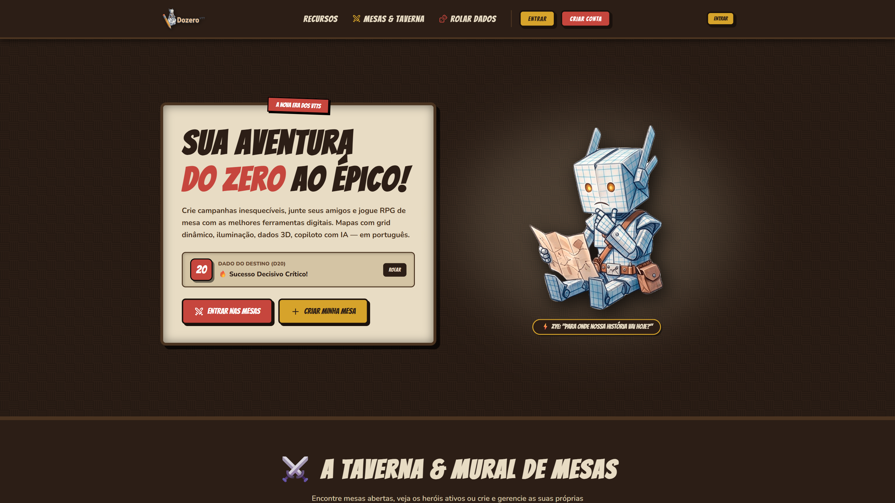

---

### 🤖 7. Assistente IA Zye & IA Studio (RAG com pgvector)
Assistente inteligente onipresente que lê as notas do seu mundo via busca semântica vetorial (`pgvector` + embeddings do Gemini), responde dúvidas sobre regras e lore, e integra a **Forja de Macros Condicionais** com gatilhos de dados e efeitos sonoros automáticos.

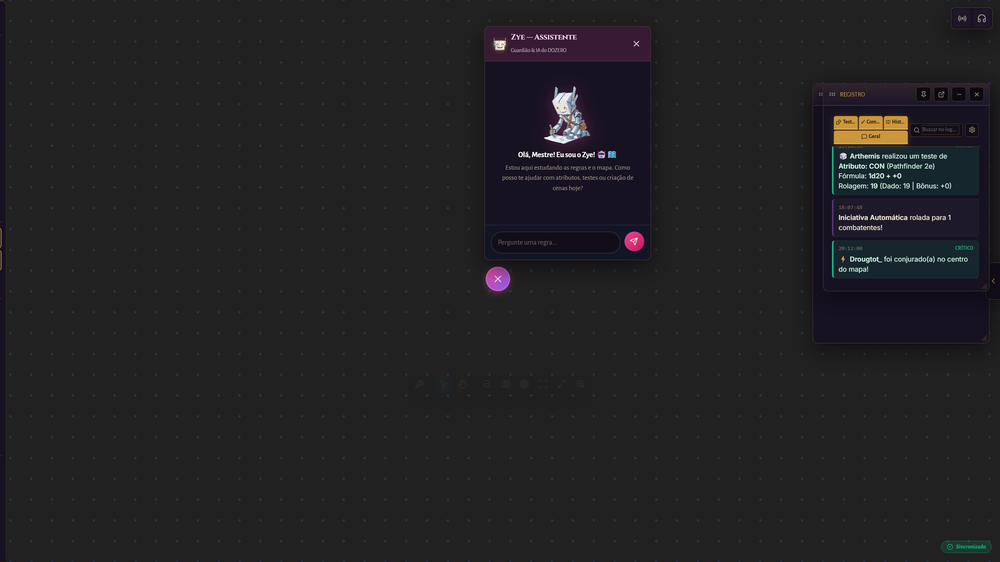

---

## ⚡ Recursos Principais

### 🎲 Mesa & Combate
- **Motor WebGL PixiJS 8:** Desempenho suave a 60 FPS mesmo com centenas de tokens, paredes e texturas 4K.
- **Grades Flexíveis:** Quadrada, Hexagonal (ponto/lado) e Isométrica com ajuste milimétrico de offset e escala.
- **Névoa de Guerra Avançada:** Pincel suave, polígonos, retângulos, círculos, triângulos e laço livre.
- **Iluminação Dinâmica & Paredes:** Paredes táticas desenhadas que bloqueiam feixes de visão e raycasting de luz.
- **Combat Tracker Automático:** Rolagem de iniciativa, gestão de condições/efeitos, timers de turno e áreas de encontro.

### 📚 Worldbuilding & Códice
- **12 Tipos Nativos de Entidades:** Personagens, Cidades, Facções, Itens Mágicos, Divindades, Monstros, Eventos e mais.
- **Atlas de Linhagem Dinástica:** Árvores genealógicas interativas para casas nobres e famílias importantes.
- **Chronica & Calendário Fantástico:** Calendários totalmente customizáveis (luas, estações, semanas) e Linha do Tempo histórica.
- **Obsidian Live Sync:** Edite suas notas no Obsidian e veja o DOZERO atualizar tokens, nós do grafo e códice instantaneamente!
- **Publicador de Livros (.dozero, PDF & Web Tomo):** Compile campanhas completas em belos livros de capa dura digitais (com temas *Grimório Arcanum*, *Pergaminho Antigo* e *Manuscrito Moderno*).

### 🎙️ Áudio & Comunicação
- **Voz P2P WebRTC de Baixa Latência:** Push-to-Talk, sliders de ganho individual (0% a 200%), supressão de ruído e VAD com sensibilidade ajustável.
- **Compartilhamento de Tela Integrado:** Com visualização Picture-in-Picture (PiP) e suporte a múltiplos monitores.
- **Rádio de Biomas:** Crossfade suave entre 8 biomas imersivos (Taverna, Floresta, Tempestade, Caverna, Noite, etc.) com VU Meter ao vivo.
- **Soundboard Procedural:** 12 sintetizadores de áudio de RPG em tempo real gerados via Web Audio API, sem latência de download.

---

## 🛠️ Stack Tecnológica

| Camada | Tecnologias Utilizadas |
|---|---|
| **Core Frontend** | [React 19 Canary](https://react.dev), [TypeScript 6.0](https://www.typescriptlang.org), [Vite 8.0](https://vitejs.dev) |
| **Renderização 2D / VTT** | [PixiJS 8.19](https://pixijs.com), `@pixi/react`, WebGL, Web Audio API |
| **Grafos & Visualização** | [@xyflow/react (React Flow 12)](https://reactflow.dev), [D3.js 7](https://d3js.org), [Mermaid 11](https://mermaid.js.org) |
| **Estado & Local-First** | [Yjs (CRDT)](https://yjs.dev), `y-indexeddb`, [Zustand 5](https://github.com/pmndrs/zustand), `idb-keyval` |
| **Backend & Nuvem** | [Supabase](https://supabase.com) (Auth, PostgreSQL, Realtime WebSocket, Storage, Edge Functions) |
| **Inteligência Artificial** | Google Gemini (`@google/generative-ai`), `pgvector` (HNSW Semantic Search) |
| **Estilização & UI** | [Tailwind CSS 4](https://tailwindcss.com), CSS Custom Properties, [Lucide React](https://lucide.dev) |
| **Testes & Qualidade** | [Vitest 4](https://vitest.dev), Testing Library, JSDOM, Puppeteer |

---

## 🚀 Como Executar

### Pré-requisitos

- **Node.js:** Versão `24.x` ou superior recomendada.
- **npm:** Versão `10.x` ou superior.

### 1. Clonar o Repositório

```bash
git clone https://github.com/Raah-Lopes/dozero.git
cd dozero
```

### 2. Instalar Dependências

```bash
npm install
```

### 3. Configurar Variáveis de Ambiente

Copie o arquivo `.env.example` para `.env.local` e configure as credenciais do seu projeto Supabase (opcional para modo local offline):

```bash
cp .env.example .env.local
```

Exemplo de `.env.local`:
```env
VITE_SUPABASE_URL=https://seu-projeto.supabase.co
VITE_SUPABASE_ANON_KEY=sua-anon-key-publica
VITE_GEMINI_API_KEY=sua-chave-gemini-opcional
```

### 4. Iniciar o Servidor de Desenvolvimento

```bash
npm run dev
```

Acesse a aplicação em: **`http://localhost:5174`** 🎉

---

## 📜 Comandos Disponíveis

| Comando | Descrição |
|---|---|
| `npm run dev` | Inicia o servidor Vite de desenvolvimento com Hot Module Replacement (HMR). |
| `npm run build` | Compila o bundle otimizado para produção. |
| `npm run preview` | Executa o preview local do build de produção. |
| `npm run lint` | Executa o linter ESLint em todo o código TypeScript e React. |
| `npm run test` | Executa a suíte de testes unitários com Vitest em modo interativo. |
| `npm run test -- --run` | Executa todos os testes automatizados em modo one-shot (CI/CD). |

---

## 📁 Estrutura do Projeto

```text
DOZERO/
├── docs/                     # Documentação técnica, status do roadmap e screenshots
│   ├── screenshots/          # Galeria de capturas de tela dos modos de jogo e Zye
│   ├── AI_CONTEXT.md         # Contexto técnico operacional para IA e desenvolvedores
│   ├── ROADMAP_STATUS.md     # Status detalhado das trilhas e fatias funcionais
│   └── ARCHITECTURE.md       # Diagramas e decisões arquiteturais
├── public/                   # Assets estáticos (ícones, áudios, mascote Zye, tokens)
│   ├── assets/               # Imagens e capturas de tela públicas
│   └── mascot/               # Ilustrações e poses oficiais do mascote Zye
├── src/                      # Código-fonte principal da aplicação
│   ├── components/           # Componentes React (HUD, Modais, Wiki, Teatro, Fichas, Widgets)
│   │   ├── Chat/             # Chat colaborativo, combat log e comandos de dados
│   │   ├── HUD/              # Barras de ferramentas, context menus e overlays
│   │   ├── Modals/           # Modais de campanhas, vault, configurações e plugins
│   │   ├── Sheets/           # Forja de Fichas Arcanum Dark Fantasy
│   │   ├── Theater/          # Teatro da Mente, cenas e diálogos cinemáticos
│   │   └── Wiki/             # Códice Arcanum, Grafo Living Brain e editores
│   ├── engine/               # Motor PixiJS 8 da Mesa Tática (GameCanvas, renderers, grid)
│   ├── hooks/                # Hooks customizados React (WindowManager, Theme, Audio, etc.)
│   ├── rules/                # Parsers de regras, sistemas de RPG e avaliadores de macros
│   ├── services/             # Yjs CRDT, Supabase Cloud, WebRTC, IA RAG e Offline Sync
│   ├── store/                # Estados compartilhados Zustand (Map, Tokens, Combate, Áudio)
│   ├── themes/               # Sistema de temas visuais (Arcanum Dark Fantasy, Sci-Fi, etc.)
│   └── utils/                # Utilitários puros testáveis (calendário, genealogia, bundle)
├── supabase/                 # Configurações do Supabase e migrations SQL versionadas
│   ├── functions/            # Edge Functions Deno (RAG Embeddings)
│   └── migrations/           # Migrations versionadas com políticas RLS estritas
├── vite-plugins/             # APIs locais em Node.js para desenvolvimento (Obsidian Watcher, Wiki API)
└── wikidozero/               # Base de conhecimento e conteúdo padrão em Markdown
```

---

## 📖 Documentação Operacional

Para aprofundar-se na arquitetura e evolução técnica do DOZERO, consulte os documentos de referência:

- 📋 **[Status do Roadmap (ROADMAP_STATUS.md)](docs/ROADMAP_STATUS.md)**: Acompanhamento de todas as trilhas concluídas e extensões.
- 🧠 **[Contexto Técnico (AI_CONTEXT.md)](docs/AI_CONTEXT.md)**: Resumo da arquitetura, convenções e invariantes operacionais.
- 📐 **[Decisões de Arquitetura (DECISIONS.md)](DECISIONS.md)**: Registros de decisões arquiteturais (ADRs) do projeto.
- 🔌 **[Especificação de Plugins (PLUGIN_SPEC.md)](PLUGIN_SPEC.md)**: Guia para criação de módulos e extensões customizadas.
- 🤝 **[Guia de Contribuição (CONTRIBUTING.md)](CONTRIBUTING.md)**: Padrões de código e fluxo de Pull Requests.

---

## 🛡️ Segurança & Privacidade

- **Local-First por Design:** Todas as suas sessões, tokens e campanhas funcionam e permanecem salvas localmente no navegador via **IndexedDB** mesmo sem conexão à internet.
- **Row Level Security (RLS) Estrita:** Todas as tabelas no Supabase possuem políticas RLS ativas para garantir isolamento absoluto entre campanhas e mestres/jogadores.
- **Zero Secrets Expostos:** Tokens de IA e credenciais privadas nunca são trafegados para outros clientes ou gravados em repositório.

---

## 🤝 Contribuição

Contribuições da comunidade são muito bem-vindas! Siga as diretrizes de [Conventional Commits](https://www.conventionalcommits.org/):

- `feat:` Nova funcionalidade
- `fix:` Correção de bug
- `docs:` Alterações na documentação
- `refactor:` Refatoração de código sem mudança de comportamento
- `perf:` Melhorias de performance
- `test:` Adição ou correção de testes

Consulte o [CONTRIBUTING.md](CONTRIBUTING.md) para mais detalhes.

---

<div align="center">

**Feito com paixão por RPG de mesa e código limpo. ✨🎲**

*Dozero © 2026 — Licença MIT.*

</div>
