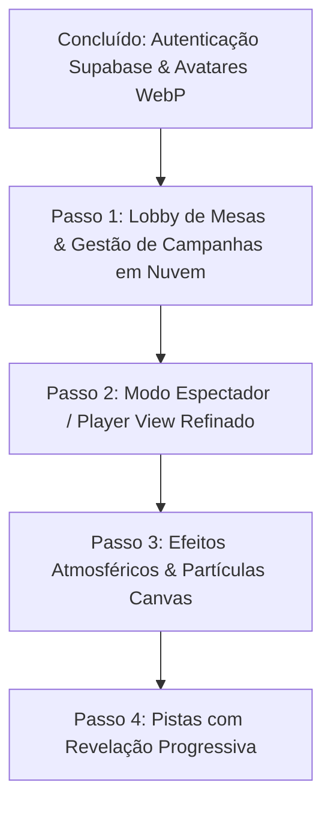

# 📜 DOZERO - Documentação de Handoff (Relatório Completo)

## 1. Visão Geral do Projeto
O **DOZERO** é uma plataforma inovadora de Virtual Tabletop (VTT) desenvolvida para jogar RPG de mesa online. O foco do projeto é proporcionar uma experiência rica, imersiva e altamente modularizada, que unifica mapa de grade interativo (Canvas), visualização em Teatro da Mente, banco de dados (Wiki) integrado e ferramentas automatizadas com suporte de Inteligência Artificial (Gemini para texto, Pollinations/Google TTS para áudio e imagens). 

Possui uma arquitetura "Glassmorphism" para os menus flutuantes que se sobrepõem ao Canvas, proporcionando um design moderno onde o tabuleiro do jogo é sempre o elemento principal em tela. Conta com suporte a sessões colaborativas P2P e multi-jogador via Yjs (CRDT).

---

## 2. Tecnologias e Linguagens Utilizadas
O projeto é uma **Single Page Application (SPA)** no frontend, construída com o ecosistema React/Vite.

**Core:**
- **TypeScript**: Linguagem principal para garantir tipagem estática e segurança no desenvolvimento.
- **React (v19)**: Biblioteca base para a construção das interfaces de usuário (HUD, Modais, Widgets).
- **Vite**: Ferramenta de build e bundler ultrarrápida.

**Motores Gráficos e de Canvas:**
- **PixiJS & @pixi/react**: Utilizados pesadamente no `GameCanvas` para renderização WebGL do mapa (tabuleiro de batalha), tokens, neblina de guerra e elementos gráficos em alta performance.
- **@xyflow/react**: Usado para criação de gráficos nodais (árvores de talentos, mapas mentais, diagramas da campanha).
- **D3.js (d3-force, d3-zoom, d3-drag) / mermaid**: Usados para visualizações interativas da Wiki (O motor do Cérebro Gráfico foi reescrito 100% em D3 e Canvas nativo para performance e correção de bugs de eventos no Windows).

**Gerenciamento de Estado e Colaboração:**
- **Zustand**: Gerenciador de estados globais leve e rápido (localizado na pasta `src/store/`).
- **Yjs** (`yjs`, `y-websocket`, `y-indexeddb`): Framework de sincronização CRDT utilizado para multijogador em tempo real e persistência local off-line no navegador.

**Ferramentas e Integrações:**
- **Lucide React**: Biblioteca de ícones (SVG).
- **@dice-roller/rpg-dice-roller**: Motor robusto de rolagem e parser de dados matemáticos de RPG.
- **@google/generative-ai**: SDK para o robô assistente e geradores de lore/NPCs via IA (Gemini).
- **React Markdown & MDXEditor**: Para visualização e edição rica de artigos da Wiki do mundo.

---

## 3. Arquitetura e Caminhos Principais

O código fonte está localizado dentro do diretório `/src`. A divisão lógica é altamente baseada em "features" ou "widgets":

### `/src/App.tsx` (Orquestrador Principal)
O ponto de entrada da aplicação. Este arquivo controla as "camadas" principais:
- **`canvas-layer`**: O fundo onde o PixiJS renderiza o mapa e os tokens.
- **`hud-layer`**: A interface de usuário React em "Glassmorphism" que flutua acima do mapa. Possui menus de ferramentas no topo e nas laterais. Controla o estado de `viewMode` (Canvas, Wiki, Theater).

### `/src/store/` (Estados Globais / Zustand)
Contém os módulos independentes de dados da sessão:
- `audioStore.ts`: Estado do Audio Mixer, trilhas carregadas e controle de volume.
- `combat.ts`: Lista de iniciativa, turnos, e atores em combate.
- `campaign.ts`, `world.ts`, `wiki.ts`: Dados de campanha, locais e documentos de lore.

### `/src/components/HUD/`
Componentes fixos da tela principal:
- `CombatTracker.tsx`: Janela arrastável que exibe a ordem de iniciativa atual.
- `NPCPanel.tsx`: Lista rápida de personagens do mestre e monstros.

### `/src/components/Widgets/`
A grande sacada do DOZERO é sua modularidade. Ferramentas são Widgets que podem ser abertos pelo Menu Principal:
- **`System/AudioDirectorWidget.tsx`**: Painel complexo de áudio. Permite o upload de arquivos locais, além de geração de voz por IA (Google TTS, 100% gratuito nativo) e Geração de Músicas/SFX (Pollinations, requer API Key). Trata erros de limite de chave (HTTP 401/402).
- **`PlayerTools/DiceRollerWidget.tsx`**: Interface para a rolagem de dados e exibição do histórico de combate.
- **`World/LoreMachineWidget.tsx` & `WorldEngineWidget.tsx`**: Ferramentas de mestre para criar conteúdo massivo e dinâmico com ajuda da IA Generativa (Gemini).

### `/src/components/Theater/`
- Componentes responsáveis pelo modo "Teatro da Mente" (`viewMode === 'theater'`), focados em destacar imagens, avatares e texto sem usar a grade de batalha tática.

---

## 4. Detalhamento de Funcionalidades Chave

### A. Interface Glassmorphism e Z-Index
- Toda a UI principal usa a classe `.glass-panel` (presente no `index.css`), o que confere o visual translúcido esmerilhado. 
- *Atenção Técnica:* A camada `hud-layer` utiliza `pointer-events: none` por padrão para permitir que o usuário clique através da UI no Canvas do mapa. No entanto, os painéis internos (onde ficam os botões) obrigatoriamente declaram `pointer-events: auto` no `style` inline para interceptar os cliques do mouse. Se um menu deixar de funcionar, verifique esta hierarquia.

### B. Integração de Áudio e IA (Audio Director)
- A plataforma mistura áudios locais e gerados por IA via URLs.
- **TTS Gratuito:** Integração com a API do Google Translate (`translate.google.com/translate_tts`) que retorna blobs de MP3 em tempo real baseados em texto. Não requer chaves e cai perfeitamente para falas de NPCs.
- **SFX / Música IA:** Realizado via `gen.pollinations.ai`. Exige uma API Key fornecida pelo usuário salva localmente (localStorage `pollinations_api_key`). Foi imbuído de tratamento de erro robusto (`status 402 - Payment Required`) para evitar quebras do React.

### C. Múltiplos Modos de Visão (`viewMode`)
O estado `viewMode` alterna entre 3 componentes macro:
1. **Canvas**: O tabuleiro de jogo (grade) com interação via mouse (PixiJS).
2. **Wiki**: Um banco de dados enciclopédico de regras e universo. Renderiza markdown e diagramas.
3. **Theater**: Uma interface imersiva, ocultando a malha quadriculada, ideal para explorações narrativas e diálogos interpretativos.

### D. Motor do Cérebro Gráfico (Wiki Graph)
- Inicialmente o gráfico de relações da Wiki (Cérebro) utilizava a biblioteca `react-force-graph-2d`. Devido a problemas sistêmicos de compatibilidade com o React 19 em Strict Mode e conflitos de eventos de mouse (pointercancel) no Windows/Chrome, o componente `WikiGraph.tsx` foi **reescrito do zero em D3.js e Canvas puro**.
- **Vantagens Atuais:** Interceptação perfeita de zoom e arrasto sem bloqueios de UI flutuante; filtro preventivo anti-crash (descarta links `.md` órfãos sem quebrar o laço de renderização). O motor customizado mantém o exato mesmo "look and feel" (Glassmorphism e física orgânica) sem overhead de wrappers do React.

---

## 5. Próximos Passos (Para novos Desenvolvedores)
Se você for continuar este projeto em outra plataforma (Cursor, Windsurf, Devin, etc.), sugerimos:
1. **Sincronização P2P:** Revisar a estabilidade do servidor Y-Websocket/WebRTC (`yjs`). Caso seja para produção, configure um provedor Hocuspocus ou Y-Websocket rodando em Node dedicado.
2. **Sistema de Tokens no PixiJS:** O arquivo do Canvas é denso. Se houver queda de frames, a melhoria passa pela refatoração da forma que o PixiJS trata os *sprites* com *culling* (ocultar do render o que estiver fora da tela).
3. **Gerador de Fichas Customizadas:** A integração do banco de dados (IndexDB via `y-indexeddb`) é perfeita para começar a guardar os templates de atributos dos personagens baseados no RPG que o grupo escolher.
4. **Dependências IA:** Fique de olho nos limites dos tokens do Gemini AI. A chave da IA de texto e o banco de imagens estão rodando suave, mas requisições excessivas (como atualizar NPCs a cada turno) podem causar bloqueios por limite de uso (*Rate Limits*).

# 🎭 Handoff & Roadmap — Teatro da Mente (VTT)

## 📌 Status Atual do Projeto
O **Teatro da Mente** atingiu um novo patamar de maturidade técnica, estabilidade e experiência do usuário (UX). Todas as pendências de persistência, menus travados e bloqueios de build/deploy na Vercel foram solucionadas.

---

## 🚀 O Que Foi Entregue e Consolidado

### 1. 🌟 Destaque Central de Personagens e NPCs em Cena
- Componente de apresentação teatral com entrada animada, badge de nome, função narrativa e barra de ações rápidas.
- Posições flexíveis: Destaque Central (`center`) ou Lateral (`right`).
- Ações rápidas de 1 clique: Remover da cena, trocar de roupa/avatar ou enviar para o Acervo.

### 2. 📚 Acervo Global de Recursos da Campanha (`TheaterAssetVault.tsx`)
- Central de mídias com categorização inteligente: **NPCs & Criaturas**, **Cenários & Locais**, **Pistas & Documentos**, **Monstros** e **Objetos/Props**.
- Sistema de busca em tempo real e alteração rápida de tags e nomes sem modais chatos.
- Projeção imediata no palco: Projete qualquer imagem como Fundo, Centro de Palco ou Pista com 1 clique.
- Dropzone automática no palco: Imagens arrastadas para a tela são cadastradas no acervo e persistidas.

### 3. 💾 Persistência Local-First com Zero Latência
- Armazenamento em dobro: Camada síncrona `localStorage` (`dozero_theater_state_v2`) + sincronização distribuída via `IndexedDB (Yjs)`.
- Imagens em cena, personagens ativos, pistas, trilhas e relógios sobrevivem a qualquer recarregamento de página (**F5**) sem atraso.

### 4. ⏱️ Relógios Táticos de Tensão HUD (`StageClockOverlay.tsx`)
- Overlay flutuante no palco com contagem regressiva em tempo real.
- Botões grandes, táteis e acessíveis: Presets rápidos (`1m`, `3m`, `5m`, `10m`, `15m`), play/pause com texto, pílulas de `+1m` / `-1m`, reset e exclusão.
- Disparo de consequências ao zerar:
  - Alarme visual pulsante com banner no palco.
  - Alerta automático enviado para o **Chat Global da Mesa** e registrado no **Diário da Sessão**.
- 100% responsivo para telas pequenas e celulares (`@media (max-width: 768px)` em formato bottom drawer).

### 5. 📜 Live Chronicle & Handout Theatrical Spotlight
- **Feed da Crônica**: Histórico translúcido de rolagens, danos e eventos na lateral do palco.

### 6. 🖼️ Integração Pixabay — Acervo Infinito de Cenários, Vídeos em Loop & NPCs (`PixabayMediaPickerModal.tsx`)
- **Cliente HTTP Dedicado** (`pixabayService.ts`): Suporte a chave de API Pixabay configurável pelo usuário no `localStorage`, com chave padrão inclusa, cache em memória e tratamento de erros.
- **Modal Universal de Busca** (`PixabayMediaPickerModal.tsx`):
  - Abas especializadas: **Cenários & Ilustrações**, **Fundos Animados (Vídeos em Loop)** e **Retratos / NPCs**.
  - 12 tags rápidas de RPG pré-configuradas (*Taverna, Masmorra, Castelo, Floresta, Fogueira, etc.*).
  - Pré-visualização instantânea de vídeos em loop ao passar o mouse.
  - Ações rápidas de 1 clique: *Definir como Fundo da Cena*, *Salvar no Acervo Global*, *Projetar Retrato de NPC* e *Apresentar Pista em Destaque*.
- **Pontos de Acesso Integrados**: Botão *Pixabay* no **Acervo Global** (`TheaterAssetVault.tsx`), no cabeçalho da cena (`ScenePanel.tsx`) e via evento global `theater-open-pixabay`.

### 7. 🎵 Motor de Áudio Nativo & Fallback Procedural Web Audio (`AudioEngine.ts` & `ProceduralAudio.ts`)
- **Loops Atmosféricos & Trilhas Rápidas**: Ambientes imersivos (Chuva/Tempestade, Taverna & Lareira, Vento Gélido, Tensão de Combate, Caverna, Floresta, Noite Estrelada e Rio) e trilhas musicais vinculáveis às cenas.
- **Soundboard de Efeitos Rápidos (SFX)**: Disparos de 1 clique para dados, espadas, impactos, portas, magias, alarmes, baús de ouro e fanfarras de vitória.
- **Resiliência Total com Síntese Procedural**: Se qualquer áudio local ou remoto for bloqueado pelo navegador ou falhar na rede, o motor Web Audio API sintetiza o som equivalente proceduralmente com 0ms de latência.
- **Mixer Global & Importador**: Suporte completo a importação de pastas locais do PC no `AudioDirectorWidget` e transmissão de links diretos/YouTube para toda a mesa.

### 8. 🛡️ Sistema de Autenticação & Nuvem Supabase (`authStore.ts` & `supabase.ts`)
- **Arquitetura Híbrida (Local-first + Nuvem)**: A partida e os combates rodam via Yjs/IndexedDB com custo zero de infraestrutura. O Supabase cuida da identidade do usuário, login social e backup.
- **Provedores Sociais (OAuth)**: Suporte completo a autenticação rápida via **Google**, **Discord** e **Facebook**, além do método tradicional com **E-mail e Senha**.
- **Redefinição de Senha Segura**: Fluxo nativo com token de recuperação por e-mail e modal de atualização de senha (`ResetPasswordModal.tsx`).
- **Otimização & Upload WebP de Avatares**: Conversão e compressão automática no navegador (`imageUtils.ts` -> WebP 256x256 @ 80% de qualidade) enviada diretamente para o bucket `avatars` do Supabase Storage.
- **Persistência de Identidade**: Chave `custom_avatar` persistente que impede que provedores OAuth (como o Google) sobrescrevam o avatar personalizado do usuário ao relogar.
- **Modo Convidado / Anônimo**: Acesso rápido sem cadastro com 1 clique para sessões expressas.
- **Modais Integrados**:
  - `AuthModal.tsx`: Login, Cadastro, Recuperação de Senha e Provedores Sociais com alternância visual e revelação de senha (`Eye`/`EyeOff`).
  - `ProfileModal.tsx`: Gerenciamento de apelido, avatar com upload WebP, data de criação da conta e logout.
  - `ResetPasswordModal.tsx`: Atualização segura de nova senha pós-link de recuperação.

---

## 🗺️ Mapa de Arquivos & Componentes Chave

| Componente / Arquivo | Responsabilidade |
| :--- | :--- |
| [`src/services/supabase.ts`](file:///d:/DOZERO/src/services/supabase.ts) | Cliente oficial inicializado com as credenciais seguras do Supabase. |
| [`src/store/authStore.ts`](file:///d:/DOZERO/src/store/authStore.ts) | Store Zustand para sessão, listeners de auth, perfil do usuário e upload de avatar. |
| [`src/components/Modals/AuthModal.tsx`](file:///d:/DOZERO/src/components/Modals/AuthModal.tsx) | Modal completo de Login/Cadastro/Recuperação com OAuth (Google, Discord, Facebook). |
| [`src/components/Modals/ProfileModal.tsx`](file:///d:/DOZERO/src/components/Modals/ProfileModal.tsx) | Modal de gerenciamento de perfil, avatar com upload e status da conta. |
| [`src/components/Modals/ResetPasswordModal.tsx`](file:///d:/DOZERO/src/components/Modals/ResetPasswordModal.tsx) | Modal de redefinição de senha para usuários vindos de link de e-mail. |
| [`src/components/LandingPage/LandingPage.tsx`](file:///d:/DOZERO/src/components/LandingPage/LandingPage.tsx) | Landing page principal com card de usuário logado, status online e abertura de modais de auth. |
| [`src/components/HUD/GMToolbar.tsx`](file:///d:/DOZERO/src/components/HUD/GMToolbar.tsx) | Barra de ferramentas do mestre com botão dinâmico de perfil/avatar. |
| [`src/utils/imageUtils.ts`](file:///d:/DOZERO/src/utils/imageUtils.ts) | Utilitários de conversão e compressão WebP de imagens/avatares. |
| [`src/components/Theater/TheaterView.tsx`](file:///d:/DOZERO/src/components/Theater/TheaterView.tsx) | Casca principal do Teatro da Mente, palco visual, topbar e orquestração de overlays. |
| [`src/services/AudioEngine.ts`](file:///d:/DOZERO/src/services/AudioEngine.ts) | Gerenciador de reprodução de áudio, canais de música/ambiente e fallback procedural. |
| [`src/services/ProceduralAudio.ts`](file:///d:/DOZERO/src/services/ProceduralAudio.ts) | Sintetizador de áudio procedural Web Audio API (100% offline, zero dependência de arquivos). |
| [`src/components/Theater/TheaterSoundscape.tsx`](file:///d:/DOZERO/src/components/Theater/TheaterSoundscape.tsx) | Jukebox e player do Teatro com abas de Ambiente, Música e Soundboard de ação rápida. |
| [`src/components/Widgets/System/AudioDirectorWidget.tsx`](file:///d:/DOZERO/src/components/Widgets/System/AudioDirectorWidget.tsx) | Mixer de canais da mesa (CH1 Música, CH2 Ambiente, SFX, Soundboard e Web YouTube). |
| [`src/components/Modals/PixabayMediaPickerModal.tsx`](file:///d:/DOZERO/src/components/Modals/PixabayMediaPickerModal.tsx) | Modal universal de busca e projeção de mídias gratuitas (fotos, ilustrações, vídeos em loop e retratos) do Pixabay. |
| [`src/services/pixabayService.ts`](file:///d:/DOZERO/src/services/pixabayService.ts) | Cliente HTTP para a API do Pixabay com tradução inteligente de termos de RPG, paginação e cache. |
| [`src/components/Theater/HeroBadge.tsx`](file:///d:/DOZERO/src/components/Theater/HeroBadge.tsx) | Cards estilo RPG antigo/vintage com drag-and-drop livre, PV, estados visuais (morto, envenenado, etc.) e menu de contexto portal. |
| [`src/components/Theater/NpcPortrait.tsx`](file:///d:/DOZERO/src/components/Theater/NpcPortrait.tsx) | Spotlight de apresentação de personagens e monstros no palco, com balão de fala e controle de escala. |
| [`src/components/Theater/VisualNovelOverlay.tsx`](file:///d:/DOZERO/src/components/Theater/VisualNovelOverlay.tsx) | Camada cinematográfica centralizada de diálogos estilo Visual Novel com typewriter, áudio, escolhas e avanço de roteiro. |
| [`src/components/Theater/CinematicDialogueStudio.tsx`](file:///d:/DOZERO/src/components/Theater/CinematicDialogueStudio.tsx) | Estúdio de fala rápida e mini-roteiros sequenciais com gerador IA, biblioteca de presets e ramificações de escolhas. |
| [`src/components/Theater/StageClockOverlay.tsx`](file:///d:/DOZERO/src/components/Theater/StageClockOverlay.tsx) | HUD flutuante de relógios de tensão, temporizador e alarmes no palco. |
| [`src/components/Theater/TheaterAssetVault.tsx`](file:///d:/DOZERO/src/components/Theater/TheaterAssetVault.tsx) | Gerenciador do Acervo Global de imagens, busca, categorização e projeção com botão Pixabay. |
| [`src/components/Theater/StageProjectorDropzone.tsx`](file:///d:/DOZERO/src/components/Theater/StageProjectorDropzone.tsx) | Captura de drag-and-drop de imagens direto na tela com auto-cadastro. |
| [`src/components/Theater/DirectorBar.tsx`](file:///d:/DOZERO/src/components/Theater/DirectorBar.tsx) | Cockpit inferior de comando rápido do Mestre (Atmosfera, Dados, Alvo, Narrativa). |
| [`src/components/Theater/DirectorPanel.tsx`](file:///d:/DOZERO/src/components/Theater/DirectorPanel.tsx) | Painel lateral avançado (Cenas, Acervo, Mecânicas, Anotações e Diário) com suporte a Pop-Out em janela flutuante. |
| [`src/store/theater.ts`](file:///d:/DOZERO/src/store/theater.ts) | Store do estado do Teatro da Mente, sincronização Yjs, persistência e helpers de roteiros e diálogos. |
| [`src/store/clocks.ts`](file:///d:/DOZERO/src/store/clocks.ts) | Lógica de estado dos relógios de tensão, gatilhos de consequência e sincronia Yjs. |
| [`src/components/Theater/Theater.css`](file:///d:/DOZERO/src/components/Theater/Theater.css) | Sistema de design, animações, temas escuros, transições, modais e regras de responsividade. |

---

## 🎯 Próximos Passos Recomendados (Roadmap Prioritário)

### 🥇 Passo 1: Lobby de Mesas & Gestão de Campanhas em Nuvem (`CampaignLobby` / Supabase DB)
* **Objetivo**: Permitir que o usuário autenticado visualize sua lista de campanhas salvas na nuvem, crie novas mesas (com nome, sistema de RPG, imagem de capa e código de convite) e convide amigos com 1 clique diretamente pela Landing Page ou VTT.
* **Benefício**: Entrega a experiência completa de plataforma SaaS, permitindo ao mestre alternar entre mesas e nunca perder o progresso.

---

### 🥈 Passo 2: Modo Espectador para Jogadores (`Player Theatrical View` / TV Mode)
* **Objetivo**: Permitir que os jogadores vejam apenas o palco limpo e imersivo (sem botões de controle do Mestre, sem abas de segredos e sem botões de edição).
* **Benefício**: Perfeito para sessões presenciais em TV/Telão secundário ou para jogadores que entram via link no navegador.

---

### 🥉 Passo 3: Efeitos Atmosféricos em Partículas (Chuva, Névoa, Brasas, Magia)
* **Objetivo**: Conectar o menu de **Atmosfera** do Diretor a uma camada visual leve em Canvas/CSS com efeitos de partículas realistas (Chuva com relâmpagos, Neblina densa, Cinzas vulcânicas, Neve suave, Luzes mágicas).
* **Benefício**: Eleva a imersão visual das cenas a nível cinematográfico sem sobrecarregar o processador.

---

### 🏅 Passo 4: Pistas Interativas com Revelação Progressiva (Fog-of-War Textual)
* **Objetivo**: Permitir que o Mestre crie cartas e documentos com trechos ocultos que são revelados aos poucos conforme os jogadores passam em testes de investigação.
